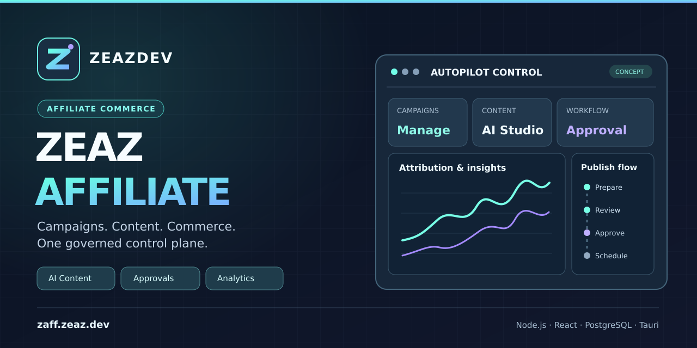

<div align="center">



# ZEAZ Affiliate

**Affiliate Commerce OS · Campaigns · Content · Commerce**

[](https://github.com/cvsz/zaffiliate/actions/workflows/ci.yml?query=branch%3Amain)
[](https://github.com/cvsz/zaffiliate/actions/workflows/codeql.yml?query=branch%3Amain)
[](https://github.com/cvsz/zaffiliate/actions/workflows/dependency-review.yml)
[](package.json)
[](LICENSE)
[](docs/release/PRODUCTION-RELEASE-GATE.md)

**[Website](https://zaff.zeaz.dev/) · [All Features](docs/FEATURES.md) · [Architecture](ARCHITECTURE.md) · [Release Gate](docs/release/PRODUCTION-RELEASE-GATE.md) · [Roadmap](ROADMAP.md) · [Security](SECURITY.md)**

</div>

> **สถานะ (28 กันยายน 2026):** โปรเจกต์มี Affiliate Core, API, React Control Plane, งาน Automation, Provider Adapters และ Windows Tauri 2 Scaffold ใน Source Code แต่ยังไม่มีหลักฐานยืนยันว่าทุกฟีเจอร์ทำงาน End-to-End บน `zaff.zeaz.dev` หรือผ่าน Production Release Gate. GitHub badges แสดงสถานะ Workflow บน `main` เท่านั้น ไม่ใช่ใบรับรอง Security หรือ Production.

## Overview / ภาพรวม

`cvsz/zaffiliate` เป็นแพลตฟอร์ม Affiliate Commerce แบบ Multi-Tenant สำหรับจัดการ Product/Offer, Affiliate Links, Campaigns, Content, Publishing Approval, Conversion Attribution, Commissions, Billing และการตรวจสอบย้อนหลัง รวมงานเดิมจาก `zaffhub`, `ztsaff`, `tiktok-shop-bot`, `tiktok-shop-sdk`, `tiktokshop-php`, `zlttbots` และ `zttlbots` ภายใต้สถาปัตยกรรมเดียว โดยยังคง Legacy Migration และ Secret-Rotation Gates ก่อน Cutover.

ระบบแยก **ความสามารถที่ Implement ใน Repository**, **หน้าจอที่มีแต่ยังไม่เชื่อม Data Provider ครบ**, **Provider Integration ที่ต้องได้รับสิทธิ์ API จริง** และ **สถานะ Deployment** อย่างชัดเจน อ่านรายฟีเจอร์ได้ที่ **[Feature Catalog](docs/FEATURES.md)**.

## Features / ความสามารถ

| Module | Repository capability | สถานะการใช้งาน |
|---|---|---|
| Dashboard & Mission Control | KPI, Revenue Trend, Integration/Worker Health และ Action Center API/UI | ต้องเชื่อมข้อมูล Production จริง |
| Campaigns | Campaign Lifecycle, Creator/Partner Model และ Durable Campaign Repository | มี Domain/API; ต้องทำ Live E2E |
| Products & Offers | Catalog, Pricing/Commission Snapshots, Promotion & Freshness Gates | มี Domain/Importer; ตรวจ Scope ของ Provider |
| Affiliate Links | Campaign-bound Links, `/go/:slug`, Click Attribution | มี Domain/API; ต้องตรวจ Redirect จริง |
| Shopee Thailand | CSV Normalizer, Thai Price/Quantity/Rate Parsing, Durable Import | Importer มีแล้ว; **ไม่เท่ากับ Video/Live Publishing** |
| Content Studio | Prompt/Script/Storyboard, Provider-Neutral AI Interface, Moderation และ Budgets | บางส่วน; Video Factory ยังเป็น Placeholder |
| Publishing & Calendar | Publication Jobs, Outbox, Policy Gate, Approval Contracts | UI บางส่วน; สิทธิ์ Provider และ Reconciliation ยังต้องพิสูจน์ |
| Approval Center | Review/Approve/Reject Workflow, RBAC และ Audit Boundaries | มี Workflow Core; Browser Session และ Immutable Media Approval ต้องตรวจ |
| Outreach & CRM | Consent, Suppression, Quiet Hours, Budgets และ Follow-up Logic | มี Domain; Real Provider Delivery ต้องยืนยัน |
| Analytics & Commissions | Funnel, Attribution, Deduplication, Pending/Confirmed/Refund/Reversal Models | มี Calculation Core; Live Provider Data ยังไม่ยืนยัน |
| Billing & Usage | Plans, Quotas, Metering, Ledger และ Reconciliation | มี Domain; Live Payment Cutover แยกตรวจ |
| Security & Operations | Tenant RLS, SSRF Controls, Webhook Replay, Audit, CodeQL, Backup/Restore Harnesses | Security Release Gate ยังเปิดอยู่ |
| Windows Desktop | Tauri 2 Shell และ PowerShell Bootstrap | **Scaffold เท่านั้น**; ยังไม่มี Signed/UAT Installer |
| Autopilot Review | Feature Cards, Status Filter, Local Reviewer Notes และ JSON Export | Read-only Review UI; ไม่ใช่ Live Health Dashboard |

เมนูอื่นใน React Control Plane ได้แก่ Connections, Publications, Conversions, Creators, Settings และ Operator Console; การแสดงเมนูหรือ Mock Interface **ไม่ใช่หลักฐานว่าฟีเจอร์นั้นพร้อมให้ลูกค้าใช้**. ดู [รายละเอียดและ Code References ครบทุกเมนู](docs/FEATURES.md).

## Platform connectors / การเชื่อมต่อแพลตฟอร์ม

- **TikTok Shop:** Signed SDK, Resource Adapter, Webhook และ OAuth Boundaries. การเรียก Affiliate API จริงต้องมี Product Scope/App Approval ตามบัญชี.
- **Shopee / Lazada:** Commerce Adapter และ Shopee Thailand CSV Ingestion. **Shopee Video และ Shopee Live ต้องมีสิทธิ์แยก**; ถ้าไม่มี ให้ใช้ Manual Handoff.
- **Facebook / Instagram Reels และ YouTube Shorts:** Publishing Contracts อยู่หลัง Approval/Policy Boundary. ยังไม่อ้างว่าเผยแพร่จริงได้จนกว่า Meta/Google Permissions, Quota/Audit และ Processing Reconciliation ผ่าน.
- **LINE:** Consent-Aware Messaging Boundary; ห้ามใช้งาน DM Automation ที่ Provider ไม่อนุญาต.
- **MoneyPrinterTurbo:** Server-Side Video Provider Adapter; ต้องมี Private Worker และ Object Storage พร้อมก่อน Real Media Output.

ดู [Provider Capability Matrix](docs/PROVIDER-CAPABILITY-MATRIX.md), [TikTok App Review](docs/TIKTOK-APP-REVIEW.md) และ [MoneyPrinterTurbo Integration](docs/MONEYPRINTER-INTEGRATION.md). **ไม่มี Platform Badge ใดใน README ที่หมายความว่าได้รับ Approved Publishing Scope แล้ว**.

## Architecture / สถาปัตยกรรม

```text
React/Vite Web  +  Tauri 2 Windows Scaffold
                       |
           Authenticated API (Node.js 22+ ESM)
                       |
       Identity / Tenant / RBAC / Policy Gate
                       |
Affiliate Core -- Campaigns -- Content -- Outreach
          \          |           /
              Workflow / Outbox
                     |
       Official Provider Adapters
                     |
PostgreSQL (Tenant RLS) + Redis + Audit + Analytics
```

Frontend ไม่ได้รับ Provider Secret; External Mutation ต้องผ่าน Tenant Authorization, Approval, Idempotency และ Audit. **Desktop Scaffold ยังขาด Packaged API Origin/Session, Release CSP และ Installer Signing**.

## Try locally / เริ่มพัฒนาบนเครื่อง

**ต้องมี:** Node.js 22+, npm, Docker Compose; Windows Desktop เพิ่ม Rust MSVC, Visual Studio C++ Build Tools/Windows SDK และ WebView2.

Linux / WSL2:

```bash
git clone https://github.com/cvsz/zaffiliate.git
cd zaffiliate
cp .env.example .env
./scripts/bootstrap.sh
npm run check
npm test
npm run build:web
```

Windows (PowerShell, Development Scaffold):

```powershell
git clone https://github.com/cvsz/zaffiliate.git
cd zaffiliate
pwsh -NoProfile -File .\scripts\bootstrap-windows.ps1 -InstallPrerequisites
cd apps/desktop
npm run dev
```

`-BuildDesktop` ใช้ทดลอง Build **Unsigned Installer Candidate** หลังมี Toolchain ครบ; ไม่ใช่การ Deploy Production. ดู [Desktop Setup](apps/desktop/README.md) และ [Development](docs/DEVELOPMENT.md).

## API & operations

API หลักมี `/api/v1/auth/*`, `/api/v1/oauth/:provider/*`, `/api/v1/campaigns`, `/api/v1/conversions`, `/go/:slug`, `/webhooks/:platform` รวมทั้ง `/healthz`, `/readyz`, `/metrics` และ `/api/v1/version`. `/readyz` ต้อง Fail-Closed เมื่อ Runtime Dependency ไม่พร้อม. Production API ปฏิเสธ Request ที่ไม่มี Authorization และ Operational Surface ที่ไม่มี Real Data Provider ต้องคืน Error แทนข้อมูลสังเคราะห์.

Self-hosting: `compose.selfhost.yaml` (PostgreSQL 17, Redis 7, API/Web) พร้อม [Operations](OPERATIONS.md) และ [Release Gate](docs/release/PRODUCTION-RELEASE-GATE.md). เว็บไซต์ [zaff.zeaz.dev](https://zaff.zeaz.dev/) เป็น Deployment Target แต่ **ไม่ได้ผ่าน Live E2E Verification ในการอัปเดตเอกสารครั้งนี้**.

## Security & release status

**ห้ามตีความ CI/CodeQL Badge สีเขียวว่า Production Ready:** ยังต้องตรวจ GitHub [Code Scanning Alert #2](https://github.com/cvsz/zaffiliate/security/code-scanning/2) ผ่าน Account ที่มีสิทธิ์, Browser Login/Session, Legacy Credential Rotation, Isolated Restore, CSP, Provider Approval, Production Traffic/TLS และ Operator Sign-off. ค่า Secret ทั้งหมดต้องเก็บฝั่ง Server และ Legacy `ztsaff` ยังอยู่ใน Quarantine ตาม [SECURITY.md](SECURITY.md).

[Production Release Gate](docs/release/PRODUCTION-RELEASE-GATE.md) · [Execution Planning](EXEC-PLANNING.md) · [Implementation Checklist](IMPLEMENTATION-CHECKLIST.md) · [Roadmap](ROADMAP.md) · [Changelog](CHANGELOG.md)

## Documentation & social preview

- [All Features](docs/FEATURES.md) — Feature Matrix แยก Source/UI/Provider/Deployment
- [Documentation Index](docs/README.md) — คู่มือ Development, Provider, Security และ Operations
- [Social Preview Artwork](docs/brand/social-preview.svg) — Editable Vector (1280×640)
- [Branding Guide](docs/brand/README.md) — ขั้นตอน Export PNG และ Upload ผ่าน GitHub Settings

GitHub Repository Social Preview ต้อง Upload รูป PNG/JPG ผ่านหน้า **Settings → General → Social preview → Edit/Upload an image** โดยตรง; การเพิ่มไฟล์หรือ README Banner เพียงอย่างเดียวไม่เปลี่ยนภาพ Social Preview ใน GitHub Settings.

## License

[MIT License](LICENSE) · ZEAZ Affiliate / ZEAZDEV.
